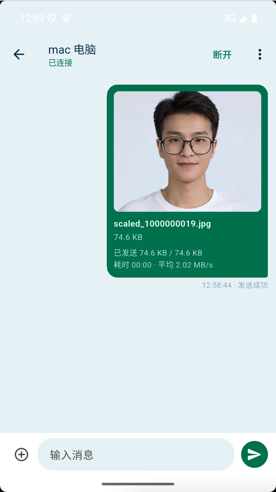
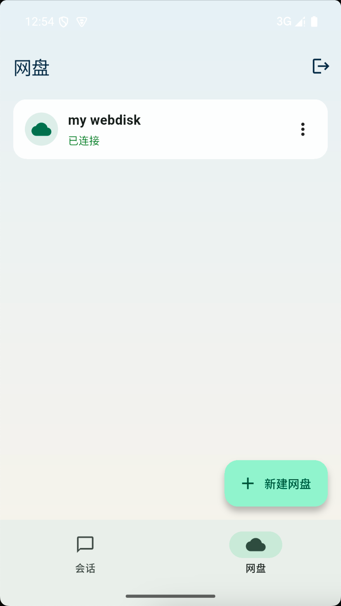
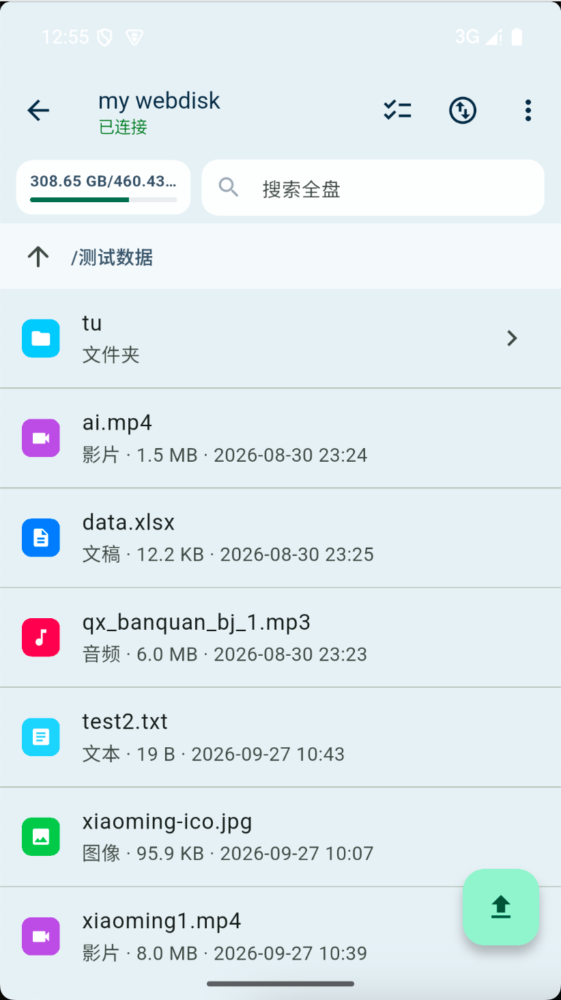

# File2File

**Android / iOS 点对点文件传输与个人网盘客户端**  
P2P 直连 · 默认加密 · 无需公网 IP · 基于 [webrpc](https://www.webrpc.cn/)

在手机上与电脑、其他手机直连传文件，或连接自己运行的个人 NAS，随时浏览、上传、下载家里的目录。数据优先走点对点加密通道，不经过中心化网盘托管。

简体中文 · [English](README.en.md)

---

## 目录

- [File2File 是什么](#file2file-是什么)
- [适合谁用](#适合谁用)
- [核心功能](#核心功能)
- [相关项目](#相关项目)
- [如何开始](#如何开始)
- [从源码构建与运行](#从源码构建与运行)
- [常见问题](#常见问题)
- [技术栈](#技术栈)
- [关键词](#关键词)

---

## File2File 是什么

**File2File**（本仓库为 Flutter 手机客户端）是一款基于 [webrpc](https://www.webrpc.cn/) 的跨平台移动应用，把两件事放在同一套界面里：

1. **点对点聊天与文件传输**：两端直连后发消息、传文件，不必先把文件上传到公有云。
2. **个人网盘 / NAS**：连接自己运行的 [`mywebdisk-server`](https://github.com/xiaoming-software/mywebdisk)，在手机上浏览、上传、下载、搜索、整理家里的磁盘目录。

通道默认加密，**不需要公网 IP**，也不要求路由器端口映射。Token 是设备身份；认证口令可限制谁能连上你。

桌面端（Windows / macOS / Linux）请使用独立仓库：  
[File2File Desktop](https://github.com/xiaoming-software/File2File-Desktop/tree/main)

---

## 适合谁用

- 经常在 **手机 ↔ 电脑 / 手机 ↔ 手机** 之间传安装包、素材、文档的人
- 希望出差或外出时，安全访问 **家里电脑或 NAS 目录**，并且文件始终存放在自己指定的磁盘上
- 已有或计划使用 [File2File Desktop](https://github.com/xiaoming-software/File2File-Desktop/tree/main) 的用户，需要配套的移动端

---

## 核心功能

### 聊天与文件传输

- 多会话管理：新建、备注、连接、断开、删除、清空本地记录
- 文字消息与文件发送（相册、系统文件选择器）
- 传输进度、失败重试；接收文件可下载或保存到相册
- 与 [File2File Desktop](https://github.com/xiaoming-software/File2File-Desktop/tree/main) 使用同一套 webrpc 会话与消息协议，可互通



*手机连上电脑后发送图片：进度、速率与「发送成功」会显示在会话里。*

### 个人网盘 / NAS

连接自建的 [`mywebdisk-server`](https://github.com/xiaoming-software/mywebdisk) 后，可在手机上：



*「网盘」页：已连接的个人网盘会话，以及「新建网盘」。*

| 能力 | 说明 |
| --- | --- |
| 浏览 | 目录列表、上级路径、容量与剩余空间 |
| 上传 / 下载 | 相册或多文件排队上传；独立任务页查看进度与重试 |
| 预览 | 文本编辑保存；图片；音视频边下边播 |
| 整理 | 新建文件夹、重命名、移动、删除、多选批量操作 |
| 搜索 | 全盘按文件名搜索 |



*进入网盘后浏览目录：容量、搜索、文件夹与各类文件一目了然。*

数据保留在你指定的服务器目录中，读写走 webrpc 加密 P2P 通道。

---

## 相关项目

| 项目 | 说明 | 链接 |
| --- | --- | --- |
| **webrpc** | P2P 传输与 Token 服务 | [https://www.webrpc.cn/](https://www.webrpc.cn/) |
| **File2File Desktop** | Windows / macOS / Linux 桌面客户端 | [GitHub 仓库](https://github.com/xiaoming-software/File2File-Desktop/tree/main) |
| **mywebdisk** | 个人网盘服务端（`mywebdisk-server`） | [GitHub 仓库](https://github.com/xiaoming-software/mywebdisk) |
| **File2File App**（本仓库） | Android / iOS 手机客户端 | 当前仓库 |

---

## 如何开始

两端（或网盘服务端）都需要 [webrpc](https://www.webrpc.cn/) 的 **Token** 与 **密码**。可在官网注册并领取 / 购买 Token；应用内也支持 **一键注册** 领取 Token（以实际界面与 webrpc 活动规则为准）。

> 请勿把 Token、密码、认证口令写入仓库、脚本或公开文档。仅在应用内填写。

### 1. 登录手机端

1. 安装 App：Android 可从 [GitHub Releases](https://github.com/xiaoming-software/File2File-App/releases) 下载 APK，或按下文从源码构建；iOS 需在 macOS 上从源码构建并签名。
2. 使用 [webrpc](https://www.webrpc.cn/) Token 与密码登录，并设置 **认证口令**（必填，对方连接你时需要）。
3. 可勾选记住账号，方便下次自动登录。

### 2. 与电脑或其他手机传文件

1. 对方使用 [File2File Desktop](https://github.com/xiaoming-software/File2File-Desktop/tree/main) 或另一台 File2File App，并保持在线。
2. 在手机端「会话」中新建连接，填写对方 Token 与对方认证口令（若有）。
3. 连接成功后即可发送文字与文件。

对方连接你时，需填写你在登录时设置的认证口令。

### 3. 连接个人网盘

1. 在存放文件的机器上，从 [mywebdisk](https://github.com/xiaoming-software/mywebdisk) 下载并启动 `mywebdisk-server`（传入该机器的 Token、密码、口令与共享目录）。
2. 手机端用**另一枚** Token 登录（不要与网盘服务端 Token 相同）。
3. 在「网盘」中新建连接，填写服务端 Token 与 `--permission` 口令。
4. 连接成功后即可浏览、上传、下载与管理文件。

服务端启动参数说明与各平台预编译程序见：[mywebdisk 仓库](https://github.com/xiaoming-software/mywebdisk)。

---

## 从源码构建与运行

Android 正式 APK 发布在 [GitHub Releases](https://github.com/xiaoming-software/File2File-App/releases)（arm64）。iOS 暂不提供商店或侧载包，需在 macOS 上从源码构建。开发调试仍建议用下面的脚本。

### 环境要求

- [Flutter](https://flutter.dev/)（本仓库以 Flutter 3.47+ / Dart 3.13+ 验证）
- Android：Android SDK、JDK；真机或 **arm64** 模拟器（webrpc Android 原生库为 `arm64-v8a`）
- iOS：Xcode 与 CocoaPods（真机需有效签名）

本仓库提供环境脚本（可选）：

```bash
source tool/env.sh
flutter doctor
```

### Android 模拟器一键运行

若已配置 AVD `File2File_API35_arm64`（建议分辨率 1080×1920）：

```bash
./tool/run_android_emulator.sh
```

或手动：

```bash
source tool/env.sh
flutter emulators --launch File2File_API35_arm64
flutter run -d emulator-5554
```

> webrpc Android 库目前仅提供 **arm64-v8a**。请使用 arm64 模拟器或 arm64 真机，不要使用 x86 系统镜像。

### iOS 模拟器一键运行

需要 macOS、Xcode，以及已安装的 iOS Simulator runtime。默认启动 **iPhone 15**：

```bash
./tool/run_ios_simulator.sh
```

指定其他机型（名称需与 `xcrun simctl list devices available` 一致）：

```bash
IOS_SIMULATOR="iPhone 15 Pro" ./tool/run_ios_simulator.sh
```

> 当前 `webrpc-sdk/libwebrpc-ios.a` 用于真机；模拟器使用 `libwebrpc-ios-simulator.a`（Apple Silicon arm64）。Intel 模拟器未覆盖。

### 通用构建

```bash
flutter pub get
flutter run          # 连接已启动的设备 / 模拟器
flutter build apk    # Android
flutter build ios    # iOS（需在 macOS + Xcode 完成签名）
```

原生 webrpc 库位于工程内 `webrpc-sdk/`；Android 侧 `libwebrpc.so` 已放入 `android/app/src/main/jniLibs/arm64-v8a/`。

### 发布 Android 安装包（GitHub Release）

改脚本顶部的 `VERSION_NAME` 后执行：

```bash
./tool/release_android.sh
```

脚本会：生成本机固定签名（首次）→ 用时间戳生成 `versionCode` → `flutter build apk --release` → 打 `v主版本号` tag 并推送 → 作为 Latest Release 上传 APK。

签名文件在 `android/keystore/upload.jks` 与 `android/key.properties`，已加入 `.gitignore`。请自行备份；丢失或更换密钥后，用户无法覆盖安装旧版。

---

## 常见问题

**和普通网盘 App 有什么区别？**  
聊天传文件是设备到设备；个人网盘功能连接的是你自己运行的 [`mywebdisk-server`](https://github.com/xiaoming-software/mywebdisk)，目录由你指定，平台不托管文件内容。

**没有公网 IP 能用吗？**  
可以。连接与传输依赖 [webrpc](https://www.webrpc.cn/)，不要求固定公网 IP 或端口映射。

**Token 从哪里获取？**  
前往 [webrpc 官网](https://www.webrpc.cn/) 注册并管理 Token；也可在 App 登录页使用一键注册（若功能可用）。

**为什么网盘要用两枚 Token？**  
一枚给家里的 `mywebdisk-server`，另一枚给手机客户端。连接网盘时，在 App 里填写**服务端那枚** Token 与口令。详见 [mywebdisk 说明](https://github.com/xiaoming-software/mywebdisk)。

**能和桌面版互通吗？**  
可以。请使用 [File2File Desktop](https://github.com/xiaoming-software/File2File-Desktop/tree/main)，双方在线并正确填写 Token / 认证口令即可。

**Android 模拟器连不上原生库？**  
确认使用 arm64 镜像与 `arm64-v8a` 的 `libwebrpc.so`，不要用 x86 模拟器。

---

## 技术栈

| 层 | 技术 |
| --- | --- |
| 应用 | Flutter（Android / iOS） |
| P2P 通道 | [webrpc](https://www.webrpc.cn/) C ABI（`dart:ffi`） |
| 本地状态 | 安全存储 Token / 会话与传输元数据 |

---

## 关键词

File2File、File2File App、P2P 文件传输、点对点传文件、手机传文件、个人网盘、个人 NAS、无公网 IP、webrpc、Flutter、Android、iOS、mywebdisk、加密传输

---

## 相关链接

- webrpc 官网（Token）：[https://www.webrpc.cn/](https://www.webrpc.cn/)
- File2File 桌面版：[https://github.com/xiaoming-software/File2File-Desktop/tree/main](https://github.com/xiaoming-software/File2File-Desktop/tree/main)
- 个人网盘服务端 mywebdisk：[https://github.com/xiaoming-software/mywebdisk](https://github.com/xiaoming-software/mywebdisk)
- 英文说明：[README.en.md](README.en.md)

> File2File 只在对端之间传数据，不托管你的文件。请自行保管 Token 与口令，只连接你信任的设备与联系人。
